# Nginx-Docker-Spring-Boot

This example has a basic configuration of NGINX, Tomcat and PostgreSQL for a Testing or Development environment. For a production environment it is necessary to activate HTTPS / SSL security in Tomcat and NGINX.

### Configure the values of file Dockerfile for PostgreSQL

*Path: /docker/postgres/*

```shell
ENV POSTGRES_USER=postgres
ENV POSTGRES_PASSWORD=root.jmtizure.k201
ENV POSTGRES_DB=wallet-zelle
```
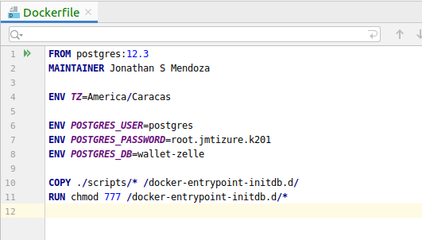

### Copy the .sql scripts that will be automatically executed inside the Docker container

*Path: /docker/postgres/scripts*


*Note: It is recommended to generate a complete script to create the schema, tables and functions.*

### Configure the values of file application.properties for Spring Boot and Tomcat

They are the same data added in the Database Dockerfile, do not change the server name.

*Path: /configuration/src/main/resources/*

```shell
spring.datasource.url=jdbc:postgresql://db-wallet:5432/wallet-zelle
spring.datasource.username=postgres
spring.datasource.password=root.jmtizure.k201
```

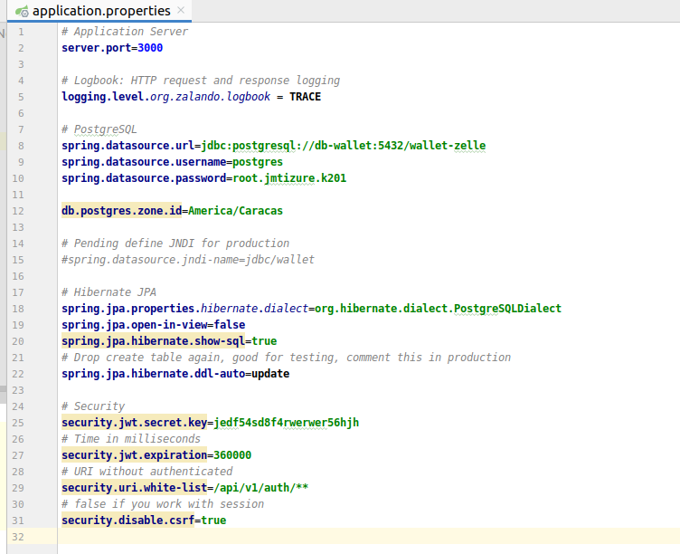

### Compile Project

```shell
jmendoza@jmendoza-ThinkPad-T420:~/IdeaProjects/JonathanM2ndoza/Nginx-Docker-Spring-Boot$ ls
api-war  application  common  configuration  docker  domain  infrastructure  pom.xml  README.md  security

jmendoza@jmendoza-ThinkPad-T420:~/IdeaProjects/JonathanM2ndoza/Nginx-Docker-Spring-Boot$ mvn clean install
```

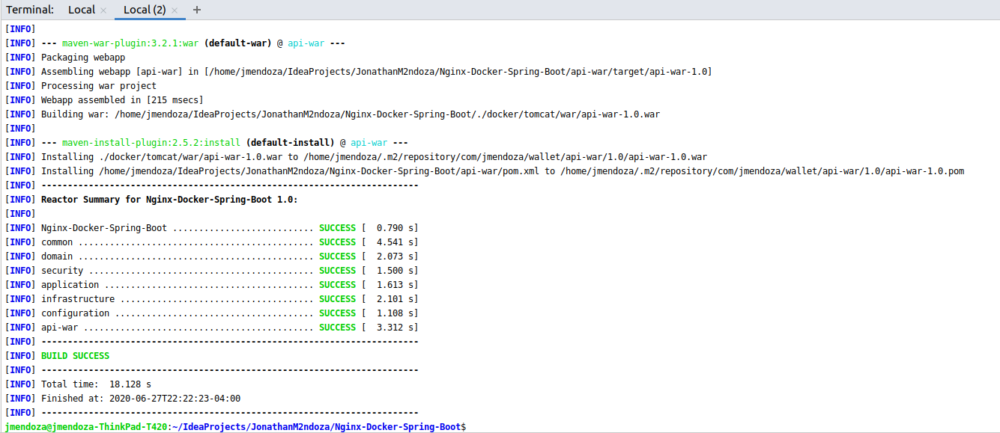

*The War file is automatically moved to the docker folder (/docker/tomcat/war/) to form the container image.*

```shell
jmendoza@jmendoza-ThinkPad-T420:~/IdeaProjects/JonathanM2ndoza/Nginx-Docker-Spring-Boot/docker/tomcat/war$ ls
api-war-1.0.war
```

*Note: The current name of the WAR file is api-war-1.0.war, if you change it then you should update it in the files Dockerfile and server.xml*

### Execute docker-compose 

```shell
jmendoza@jmendoza-ThinkPad-T420:~/IdeaProjects/JonathanM2ndoza/Nginx-Docker-Spring-Boot/docker$ docker-compose up -d --build

Successfully built 8fa0fc3835ef
Successfully tagged nginx-wallet:1.0
Creating docker_db-wallet_1 ... done
Creating docker_api-wallet_1 ... done
Creating docker_nginx-wallet_1 ... done
jmendoza@jmendoza-ThinkPad-T420:~/IdeaProjects/JonathanM2ndoza/Nginx-Docker-Spring-Boot/docker$ 

```

### Database scripts executed

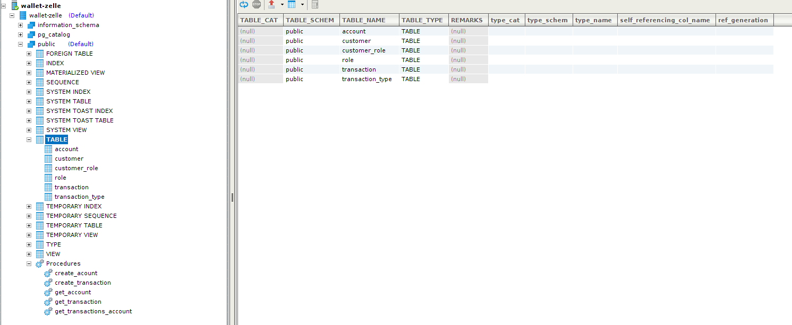

### Containers

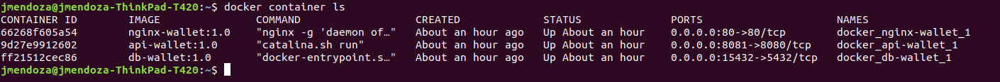

### Postman Sign In

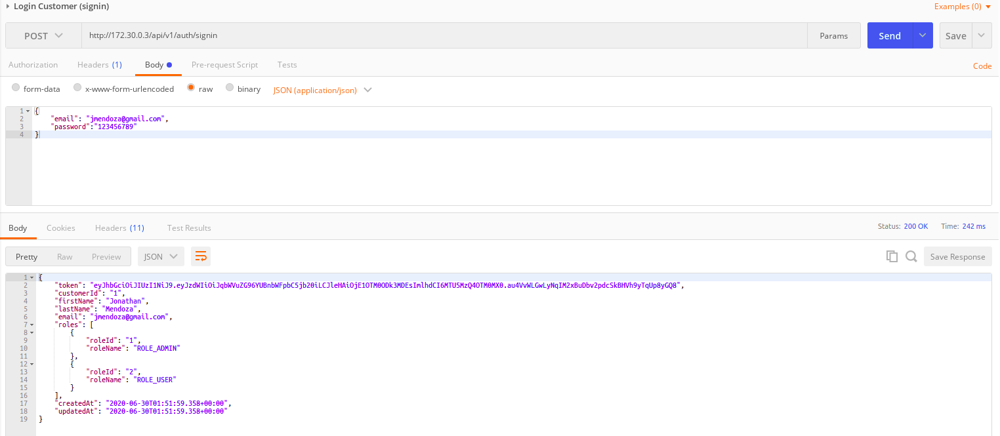

### Log NGINX

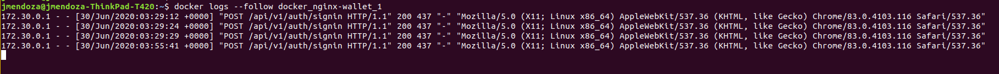

### Log Tomcat

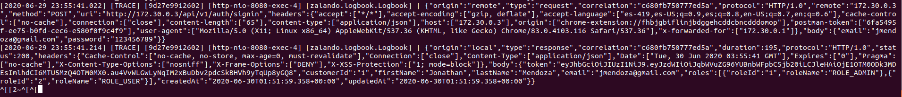

### Stop environment

```shell
jmendoza@jmendoza-ThinkPad-T420:~/IdeaProjects/JonathanM2ndoza/Nginx-Docker-Spring-Boot/docker$ docker-compose stop
Stopping docker_nginx-wallet_1 ... done
Stopping docker_api-wallet_1   ... done
Stopping docker_db-wallet_1    ... done
```

### Start environment

```shell
jmendoza@jmendoza-ThinkPad-T420:~/IdeaProjects/JonathanM2ndoza/Nginx-Docker-Spring-Boot/docker$ docker-compose start
Starting db-wallet    ... done
Starting api-wallet   ... done
Starting nginx-wallet ... done
```

## Update .war file inside the api-wallet container

Make your code change and only if there are no changes in BD then no need to recreate all images and docker containers.

Just compile the project with the following command:

```shell
jmendoza@jmendoza-ThinkPad-T420:~/IdeaProjects/JonathanM2ndoza/Nginx-Docker-Spring-Boot$ mvn clean install
```

The .war file will be automatically moved to the folder: /docker/tomcat/war/

```shell
jmendoza@jmendoza-ThinkPad-T420:~/IdeaProjects/JonathanM2ndoza/Nginx-Docker-Spring-Boot/docker/tomcat/war$ ls
api-war-1.0.war
```

Run the following command to update the .war

```shell
jmendoza@jmendoza-ThinkPad-T420:~/IdeaProjects/JonathanM2ndoza/Nginx-Docker-Spring-Boot/docker/tomcat/war$ docker cp api-war-1.0.war docker_api-wallet_1:/usr/local/tomcat/webapps/
```

It is not necessary to restart the environment. The file will be deployed automatically within the Tomcat server and the change will be available.

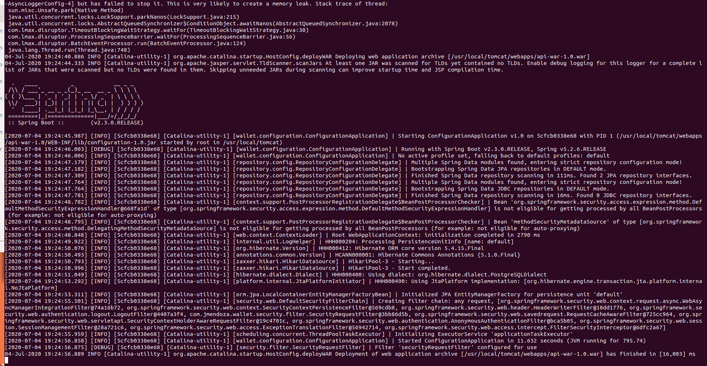

## If you have changes in code and database 

- Delete the containers with the following command, no need to delete docker images.

```shell
jmendoza@jmendoza-ThinkPad-T420:~/IdeaProjects/JonathanM2ndoza/Nginx-Docker-Spring-Boot/docker$ docker-compose down
Stopping docker_nginx-wallet_1 ... done
Stopping docker_api-wallet_1   ... done
Stopping docker_db-wallet_1    ... done
Removing docker_nginx-wallet_1 ... done
Removing docker_api-wallet_1   ... done
Removing docker_db-wallet_1    ... done
Removing network docker_database_network
Removing network docker_nginx_network
```

- Delete volume, for the new database script to run. 

```shell
jmendoza@jmendoza-ThinkPad-T420:~$ docker volume rm docker_api_volume docker_database_volume
docker_api_volume
docker_database_volume
```

- Create new environment.

```shell
jmendoza@jmendoza-ThinkPad-T420:~/IdeaProjects/JonathanM2ndoza/Nginx-Docker-Spring-Boot/docker$ docker-compose up -d --build

Successfully built 8fa0fc3835ef
Successfully tagged nginx-wallet:1.0
Creating docker_db-wallet_1 ... done
Creating docker_api-wallet_1 ... done
Creating docker_nginx-wallet_1 ... done
```

## API in debug mode 

- Find IP address of docker_api-wallet_1 container, to configure debug mode

```shell
jmendoza@jmendoza-ThinkPad-T420:~$ docker inspect docker_api-wallet_1
```

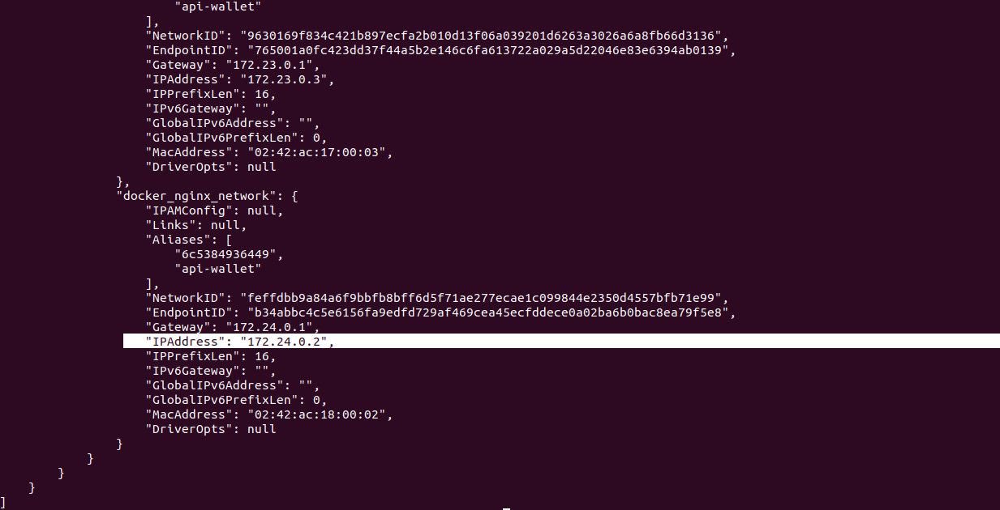

- Configure debug mode in IntelliJ

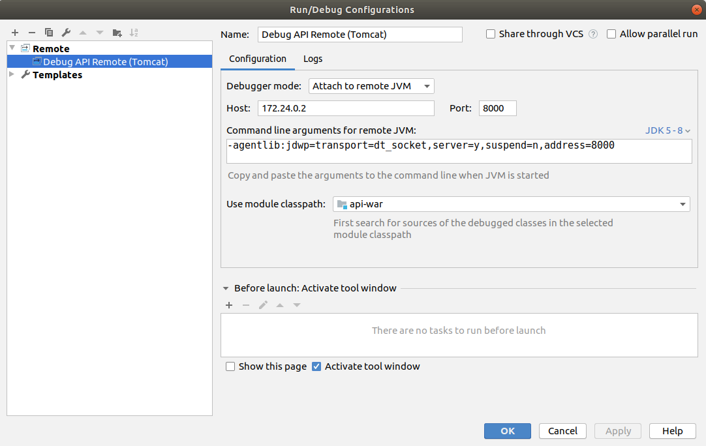

- Set breakpoints and Run debug mode

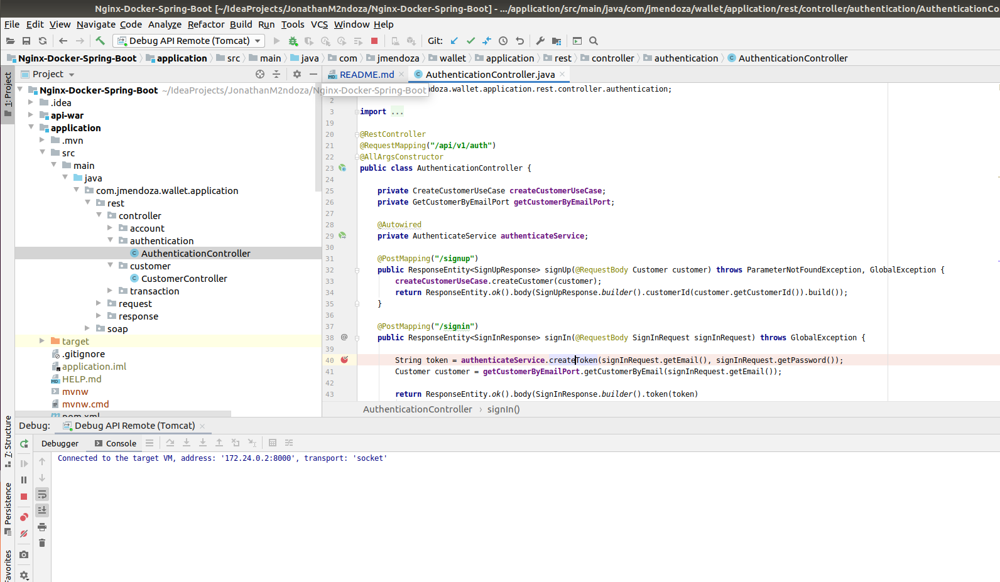

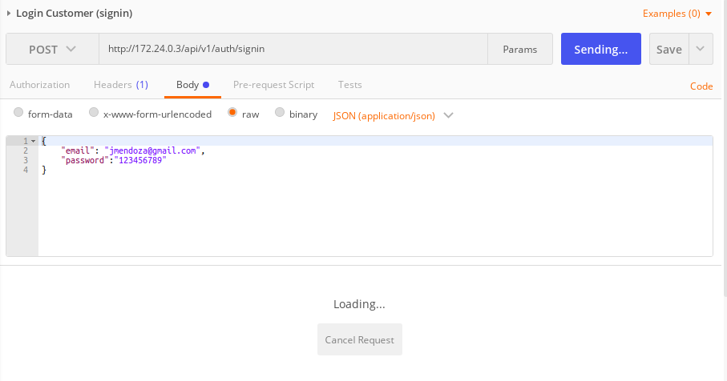

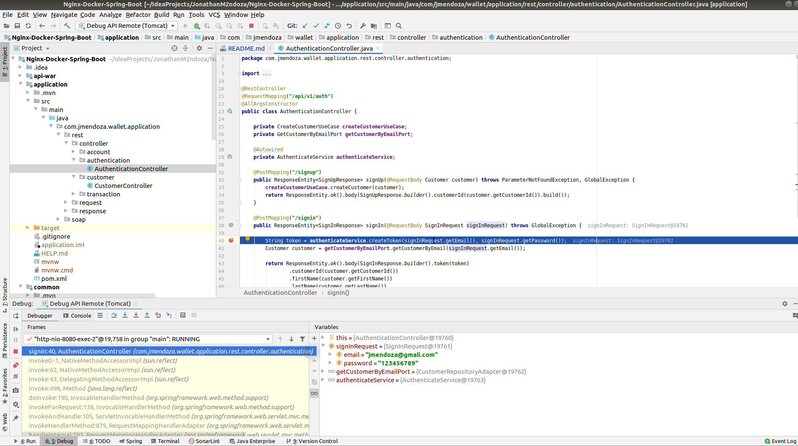


## System Architecture

soon
