# Nginx-Docker-Spring-Boot

Example of how to use Hexagonal Architecture, S.O.L.I.D Principles and the basic of Domain Driven Design (DDD) 

This example has a basic configuration of NGINX, Tomcat and PostgreSQL for a Testing or Development environment. For a production environment it is necessary to activate HTTPS / SSL security in Tomcat and NGINX.

## Technical Prerequisites

Install the following applications and development tools:

- Linux Ubuntu 18.04.4 LTS
- Docker 19.03.12
- Docker Compose 1.26.0
- Java 8
- Maven 3.6.0
- IntelliJ IDEA (Recommended)

```shell

jmendoza@jmendoza-ThinkPad-T420:~$ docker -v
Docker version 19.03.12, build 48a66213fe

jmendoza@jmendoza-ThinkPad-T420:~$ docker-compose -v
docker-compose version 1.26.0, build d4451659

jmendoza@jmendoza-ThinkPad-T420:~$ java -version
java version "1.8.0_221"
Java(TM) SE Runtime Environment (build 1.8.0_221-b11)
Java HotSpot(TM) 64-Bit Server VM (build 25.221-b11, mixed mode)

jmendoza@jmendoza-ThinkPad-T420:~$ mvn -v
Apache Maven 3.6.0
Maven home: /usr/share/maven
Java version: 1.8.0_221, vendor: Oracle Corporation, runtime: /usr/lib/jvm/jdk1.8.0_221/jre
Default locale: es_VE, platform encoding: UTF-8
OS name: "linux", version: "5.3.0-61-generic", arch: "amd64", family: "unix"

```

### API project structure

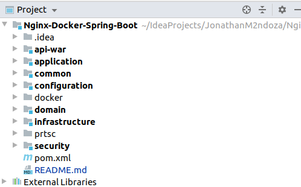

- **api-dinbog-war:** Group the project modules to generate the WAR

- **application:** The application layer provides different adapters for outside entities to interact with the domain through the port.

- **common:** General components for the project

- **configuration:** General settings for the project

- **docker:** Creation of development environment

- **domain:** The domain layer represents the inside of the application and provides ports to interact with application use cases (business logic).

- **infrastructure:** The infrastructure layer provide adapters and server-side logic to interact with the application from the right side. Server-side entities, such as a database or other run-time devices, use these adapters to interact with the domain.

- **security:** Security module for the API

### Configure the values of file Dockerfile for PostgreSQL

*Path: /docker/postgres/*

```shell
ENV POSTGRES_USER=postgres
ENV POSTGRES_PASSWORD=root.jmtizure.k201
ENV POSTGRES_DB=wallet-zelle
```


### Copy the .sql scripts that will be automatically executed inside the Docker container

*Path: /docker/postgres/scripts*


*Note: It is recommended to generate a complete script to create the schema, tables and functions.*

### Configure the values of file application.properties for Spring Boot and Tomcat

They are the same data added in the Database Dockerfile, do not change the server name.

*Path: /configuration/src/main/resources/*

```shell
spring.datasource.url=jdbc:postgresql://db-wallet:5432/wallet-zelle
spring.datasource.username=postgres
spring.datasource.password=root.jmtizure.k201
```


### Compile Project

```shell
jmendoza@jmendoza-ThinkPad-T420:~/IdeaProjects/JonathanM2ndoza/Nginx-Docker-Spring-Boot$ ls
api-war  application  common  configuration  docker  domain  infrastructure  pom.xml  README.md  security

jmendoza@jmendoza-ThinkPad-T420:~/IdeaProjects/JonathanM2ndoza/Nginx-Docker-Spring-Boot$ mvn clean install
```


*The War file is automatically moved to the docker folder (/docker/tomcat/war/) to form the container image.*

```shell
jmendoza@jmendoza-ThinkPad-T420:~/IdeaProjects/JonathanM2ndoza/Nginx-Docker-Spring-Boot/docker/tomcat/war$ ls
api-war-1.0.war
```

*Note: The current name of the WAR file is api-war-1.0.war, if you change it then you should update it in the files Dockerfile and server.xml*

### Execute docker-compose 

```shell
jmendoza@jmendoza-ThinkPad-T420:~/IdeaProjects/JonathanM2ndoza/Nginx-Docker-Spring-Boot/docker$ docker-compose up -d --build

Successfully built 8fa0fc3835ef
Successfully tagged nginx-wallet:1.0
Creating docker_db-wallet_1 ... done
Creating docker_api-wallet_1 ... done
Creating docker_nginx-wallet_1 ... done
jmendoza@jmendoza-ThinkPad-T420:~/IdeaProjects/JonathanM2ndoza/Nginx-Docker-Spring-Boot/docker$ 

```

### Database scripts executed


### Containers


### Postman Sign In


### Review PostgreSQL logs

```shell
jmendoza@jmendoza-ThinkPad-T420:~$ docker logs --follow docker_db-wallet_1 
```

### Log NGINX

```shell
jmendoza@jmendoza-ThinkPad-T420:~$ docker logs --follow docker_nginx-wallet_1 
```


### Log Tomcat

```shell
jmendoza@jmendoza-ThinkPad-T420:~$ docker logs --follow docker_api-wallet_1 
```


### Stop environment

```shell
jmendoza@jmendoza-ThinkPad-T420:~/IdeaProjects/JonathanM2ndoza/Nginx-Docker-Spring-Boot/docker$ docker-compose stop
Stopping docker_nginx-wallet_1 ... done
Stopping docker_api-wallet_1   ... done
Stopping docker_db-wallet_1    ... done
```

### Start environment

```shell
jmendoza@jmendoza-ThinkPad-T420:~/IdeaProjects/JonathanM2ndoza/Nginx-Docker-Spring-Boot/docker$ docker-compose start
Starting db-wallet    ... done
Starting api-wallet   ... done
Starting nginx-wallet ... done
```

## Update .war file inside the docker_api-wallet_1 container

- Make your code change and only if there are no changes in BD then no need to recreate all images and docker containers.

- Just compile the project with the following command:

```shell
jmendoza@jmendoza-ThinkPad-T420:~/IdeaProjects/JonathanM2ndoza/Nginx-Docker-Spring-Boot$ mvn clean install
```

- The .war file will be automatically moved to the folder: /docker/tomcat/war/

```shell
jmendoza@jmendoza-ThinkPad-T420:~/IdeaProjects/JonathanM2ndoza/Nginx-Docker-Spring-Boot/docker/tomcat/war$ ls
api-war-1.0.war
```

- Run the following command to update the .war

```shell
jmendoza@jmendoza-ThinkPad-T420:~/IdeaProjects/JonathanM2ndoza/Nginx-Docker-Spring-Boot/docker/tomcat/war$ docker cp api-war-1.0.war docker_api-wallet_1:/usr/local/tomcat/webapps/
```

*It is not necessary to restart the environment. The file will be deployed automatically within the Tomcat server and the change will be available.*

*In case of taking the changes, then restart the entire environment.*

```shell
jmendoza@jmendoza-ThinkPad-T420:~/IdeaProjects/JonathanM2ndoza/Nginx-Docker-Spring-Boot/docker$ docker-compose stop
Stopping docker_nginx-wallet_1 ... done
Stopping docker_api-wallet_1   ... done
Stopping docker_db-wallet_1    ... done

jmendoza@jmendoza-ThinkPad-T420:~/IdeaProjects/JonathanM2ndoza/Nginx-Docker-Spring-Boot/docker$ docker-compose start
Starting db-wallet    ... done
Starting api-wallet   ... done
Starting nginx-wallet ... done
```


## If you have changes in code and database 

- Delete the containers with the following command, no need to delete docker images.

```shell
jmendoza@jmendoza-ThinkPad-T420:~/IdeaProjects/JonathanM2ndoza/Nginx-Docker-Spring-Boot/docker$ docker-compose down
Stopping docker_nginx-wallet_1 ... done
Stopping docker_api-wallet_1   ... done
Stopping docker_db-wallet_1    ... done
Removing docker_nginx-wallet_1 ... done
Removing docker_api-wallet_1   ... done
Removing docker_db-wallet_1    ... done
Removing network docker_database_network
Removing network docker_nginx_network
```

- Delete volume, for the new database script to run. 

```shell
jmendoza@jmendoza-ThinkPad-T420:~$ docker volume rm docker_api_volume docker_database_volume
docker_api_volume
docker_database_volume
```

- Create new environment.

```shell
jmendoza@jmendoza-ThinkPad-T420:~/IdeaProjects/JonathanM2ndoza/Nginx-Docker-Spring-Boot/docker$ docker-compose up -d --build

Successfully built 8fa0fc3835ef
Successfully tagged nginx-wallet:1.0
Creating docker_db-wallet_1 ... done
Creating docker_api-wallet_1 ... done
Creating docker_nginx-wallet_1 ... done
```

## API in debug mode 

- Find IP address of docker_api-wallet_1 container, to configure debug mode

```shell
jmendoza@jmendoza-ThinkPad-T420:~$ docker inspect docker_api-wallet_1
```


- Configure debug mode in IntelliJ


- Set breakpoints and Run debug mode


## Create Account and Create Transactions

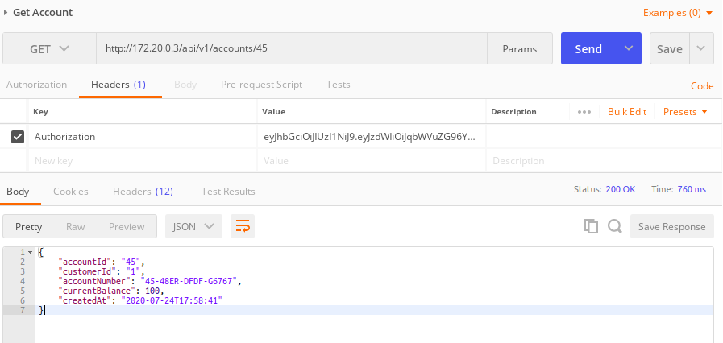

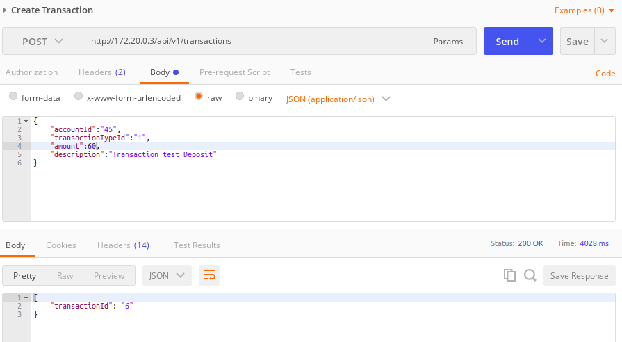

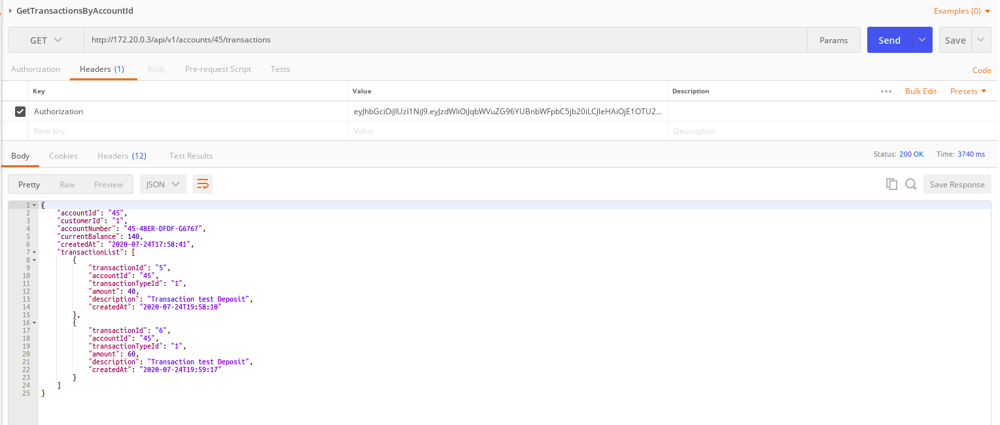

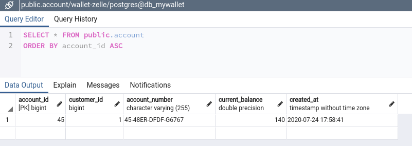

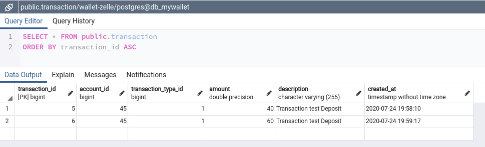

## System Architecture

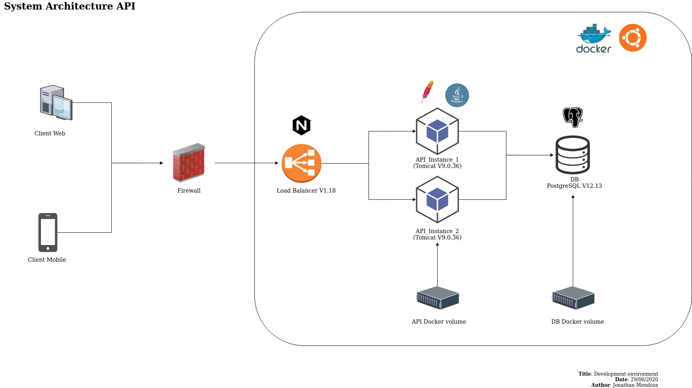

## Spring REST Docs

**Note: Before run maven with test, please add the following entry in your hosts file**

- Find the IP of the Database container (docker_db-wallet_1)

```shell
jmendoza@jmendoza-ThinkPad-T420:~$ docker inspect docker_db-wallet_1
```

- Add the following entry in your hosts file. Path in linux: /etc/hosts

```shell
172.19.0.2 db-wallet
```

- Add comment in pom.xml --> configuration of maven-surefire-plugin

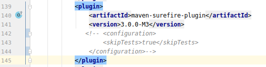

- Now if you can run: mvn clean install

```shell
jmendoza@jmendoza-ThinkPad-T420:~/IdeaProjects/JonathanM2ndoza/Nginx-Docker-Spring-Boot$ mvn clean install
[INFO] Scanning for projects...
[INFO] ------------------------------------------------------------------------
[INFO] Reactor Build Order:
[INFO] 
[INFO] Nginx-Docker-Spring-Boot                                           [pom]
[INFO] common                                                             [jar]
[INFO] domain                                                             [jar]
[INFO] security                                                           [jar]
[INFO] application                                                        [jar]
[INFO] infrastructure                                                     [jar]
[INFO] configuration                                                      [jar]
[INFO] api-war                                                            [war]
[INFO] 
[INFO] ---------------------< com.jmendoza.wallet:zelle >----------------------
[INFO] Building Nginx-Docker-Spring-Boot 1.0                              [1/8]
[INFO] --------------------------------[ pom ]---------------------------------

[INFO] ---------------------< com.jmendoza.wallet:common >---------------------
[INFO] Building common 1.0                                                [2/8]
[INFO] --------------------------------[ jar ]---------------------------------

[INFO] ---------------------< com.jmendoza.wallet:domain >---------------------
[INFO] Building domain 1.0                                                [3/8]
[INFO] --------------------------------[ jar ]---------------------------------

[INFO] --------------------< com.jmendoza.wallet:security >--------------------
[INFO] Building security 1.0                                              [4/8]
[INFO] --------------------------------[ jar ]---------------------------------

[INFO] ------------------< com.jmendoza.wallet:application >-------------------
[INFO] Building application 1.0                                           [5/8]
[INFO] --------------------------------[ jar ]---------------------------------

[INFO] -----------------< com.jmendoza.wallet:infrastructure >-----------------
[INFO] Building infrastructure 1.0                                        [6/8]
[INFO] --------------------------------[ jar ]---------------------------------


[INFO] -----------------< com.jmendoza.wallet:configuration >------------------
[INFO] Building configuration 1.0                                         [7/8]
[INFO] --------------------------------[ jar ]---------------------------------

[INFO] --- maven-surefire-plugin:2.22.2:test (default-test) @ configuration ---
[INFO] 
[INFO] -------------------------------------------------------
[INFO]  T E S T S
[INFO] -------------------------------------------------------
[INFO] Running com.jmendoza.wallet.configuration.ConfigurationApplicationTest
[2020-07-27 01:42:44.594] [INFO] [jmendoza-ThinkPad-T420] [main] [test.context.SpringBootTestContextBootstrapper] | Neither @ContextConfiguration nor @ContextHierarchy found for test class [com.jmendoza.wallet.configuration.ConfigurationApplicationTest], using SpringBootContextLoader

[INFO] Tests run: 1, Failures: 0, Errors: 0, Skipped: 0, Time elapsed: 25.395 s - in com.jmendoza.wallet.configuration.ConfigurationApplicationTest
[INFO] Running com.jmendoza.wallet.configuration.controller.authentication.AuthenticationControllerTest

[INFO] 
[INFO] Results:
[INFO] 
[INFO] Tests run: 2, Failures: 0, Errors: 0, Skipped: 0
[INFO] 
[INFO] 
[INFO] --- asciidoctor-maven-plugin:1.5.8:process-asciidoc (generate-docs) @ configuration ---
[INFO] Using 'UTF-8' encoding to copy filtered resources.
[INFO] Copying 0 resource
[INFO] Rendered /home/jmendoza/IdeaProjects/JonathanM2ndoza/Nginx-Docker-Spring-Boot/configuration/src/main/asciidoc/api-guide.adoc

[INFO] --------------------< com.jmendoza.wallet:api-war >---------------------
[INFO] Building api-war 1.0                                               [8/8]
[INFO] --------------------------------[ war ]---------------------------------

[INFO] ------------------------------------------------------------------------
[INFO] Reactor Summary for Nginx-Docker-Spring-Boot 1.0:
[INFO] 
[INFO] Nginx-Docker-Spring-Boot ........................... SUCCESS [  2.425 s]
[INFO] common ............................................. SUCCESS [  9.448 s]
[INFO] domain ............................................. SUCCESS [  3.676 s]
[INFO] security ........................................... SUCCESS [  3.141 s]
[INFO] application ........................................ SUCCESS [  2.770 s]
[INFO] infrastructure ..................................... SUCCESS [  2.981 s]
[INFO] configuration ...................................... SUCCESS [ 55.123 s]
[INFO] api-war ............................................ SUCCESS [  8.383 s]
[INFO] ------------------------------------------------------------------------
[INFO] BUILD SUCCESS
[INFO] ------------------------------------------------------------------------
[INFO] Total time:  01:30 min
[INFO] Finished at: 2020-07-27T01:43:40-04:00
[INFO] ------------------------------------------------------------------------

```

### Generated Documentation

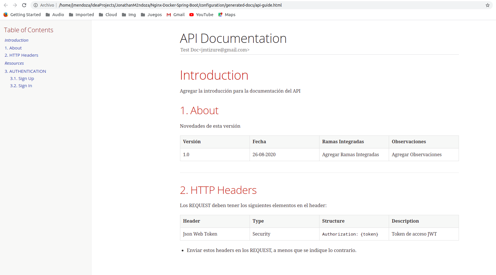

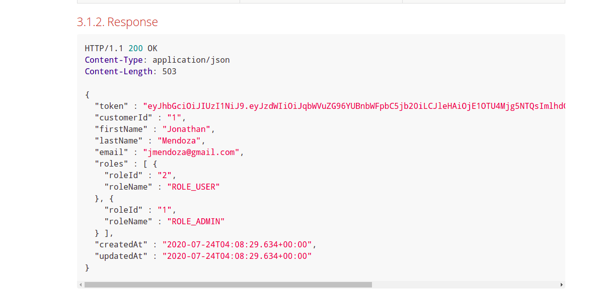

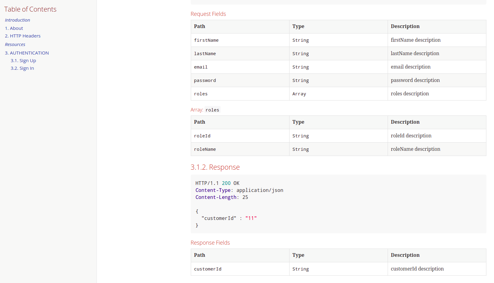

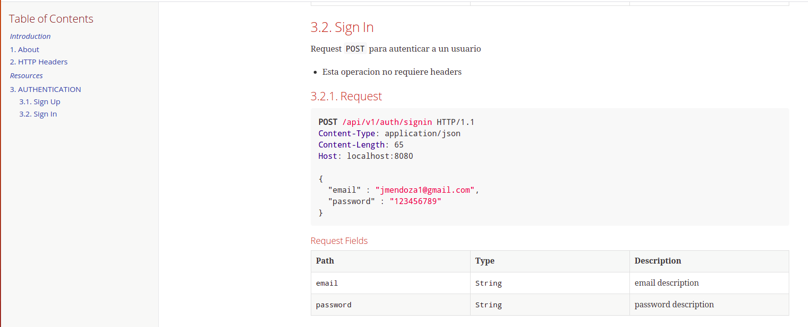

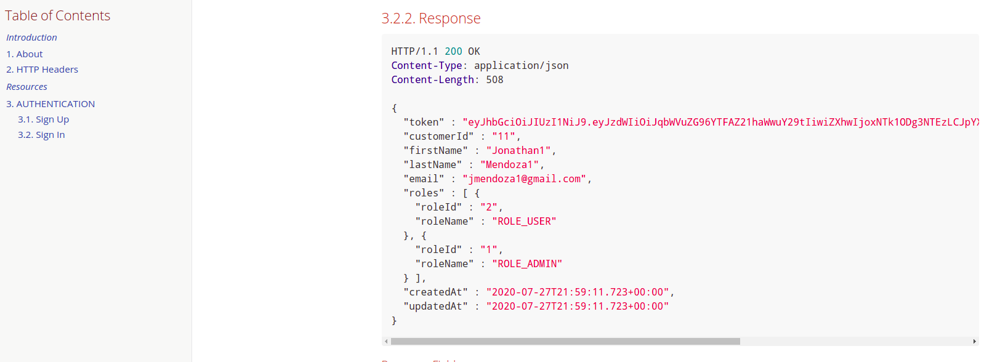

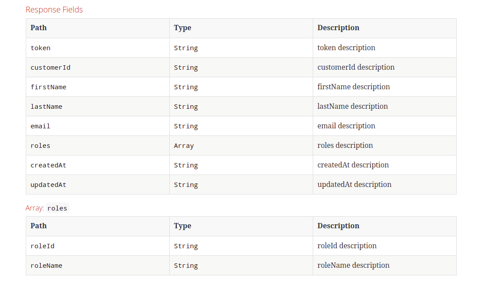
